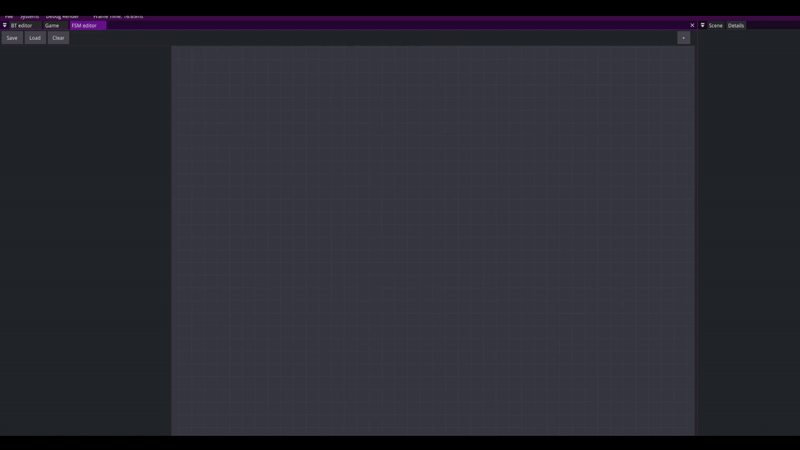
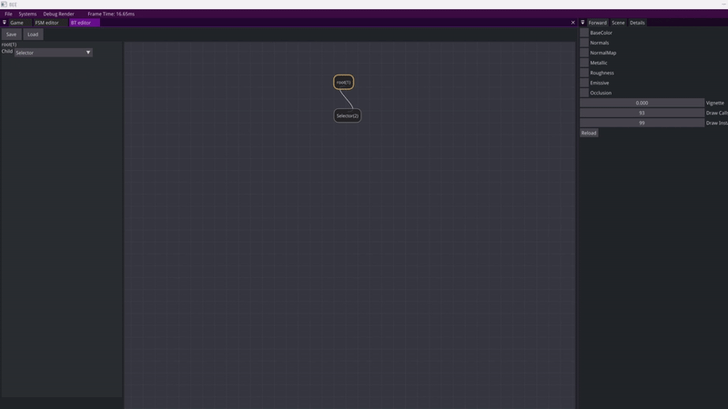

# Building an AI First aid kit- showcase and overview.
 
## Introduction:

For the last eight weeks, I have been working on a research project at Breda University of Applied Sciences regarding my favorite subject in game development- game AI. For years as a hobbyist game programmer, I used multiple AI solutions and toolkits, including the ones built into commercial game engines, popular plugins, and in-house solutions, I also experimented with different behavior selection structures: Behavior Trees, Finite State Machines, Utility AI, as well as spent a considerable amount of time researching Goal Oriented Action Planners and Hierarchical task networks. Last year at the university, I mostly worked on games in custom engines or made from scratch in C++, at this time I couldn’t find a premade solution that would be simple to use, easy to integrate into a project, that would give me flexibility, as well as the tools for debugging or editing the previously created behavioral structures. Having a need for such a tool, as well as having experience with the topic from a user's perspective, I decided to create a library that would solve the problems I had. I present to you my Finite State Machine and Behavior tree library with debugging and editor toolkit. My main goal with this blog post is to showcase my approach to creating AI APIs architecture and show my implementation of it. This text is mostly intended for people who are at least familiar with the basic premise of Behavior Selection structures and basic theory behind them.

## The features:
### Blackboards

Blackboards are containers that represent knowledge of an AI agent- they are similar in structure to maps, each key (a string) has an associated element. The user can easily store and retrieve elements of different types from the blackboard. They can be used both to store and use the data in AI actions, but also they are a fundamental part of making decisions inside the Finite State Machines and Behavior Trees- which is going to be discussed later.

```cpp
Blackboard blackboard{};
blackboard.SetData("Training",false);
blackboard.SetData("Timer",15.0f);
blackboard.SetData("Name",std::string("George"));
```

Data can be retrieved either by value:

```cpp
bool isTraining = blackboard.GetData<bool>("Training).value();
float currentTimer = blackboard.GetData<float>("Timer").value();
std::string myName = blackboard.GetData<std::string>("Name).value();
```

Or by reference for faster modyfing the contents:

```cpp
bool& isTraining = blackboard.GetReference<bool>("Training);
float& currentTimer = blackboard.GetReference<float>("Timer");
std::string& myName = blackboard.GetReference<std::string>("Name);
```

Apart from that the user can check if an element with a given key exists if necessary:

```cpp
if(blackboard.HasKey("Name"))return;
```

### Finite State Machines

My Finite State Machine implementation stems from my strict and specific requirements: I wanted the structure to be reusable in multiple different contexts, use the previously mentioned blackboards for transitioning between states, as well as to be easy to use and construct and add new States to. My biggest inspiration from the existing solution was Unity Animator controller, which is most commonly used for animation, but I have seen successful attempts of using it for game AI as well. The first step of using the FSMs is creating state child classes with one’s defined logic:

```cpp
class TestState : public AI::State
{
public:
    void Initialize(AI::StateMachineContext& context) override
    {
        //Set up method called when state is entered into
    }
    void Update(AI::StateMachineContext& context) override
    {
        //Method called on State Machine's tick 
    }
    void End(AI::StateMachineContext& context) override
    {
        //Cleanup function called when state transitions to another one
    }
}
```
It is worth to remember that the architecture I created doesn't facilitate the user to store any information regarding state execution (data specific for a single agent)- the runtime data should be stored in AI::StateMachineContext, which by default contains just a blackboard, but can be easily extended to store more data that is relevant for specific game implementations. This allows multiple agents to use one Finite State Machine, as well as ensures thread safety of the execution.

After the states are defined, one can easily construct the Finite State Machine. Starting with adding the states, then specifying the transitions between them. It is worth noting that the states can be initialized with any constructor and contain any data. 

``` cpp
// IDLE
auto idle = fsm.AddState<AnimationState>(true,0,4,graphics2d::SpriteAnimation::Mode::PingPong,0.1f);
// RUNNING
auto running = fsm.AddState<AnimationState>(false, 5, 9, graphics2d::SpriteAnimation::Mode::PingPong,0.07f);
// JUMPING
auto jumping = fsm.AddState<AnimationState>(false, 30, 37, graphics2d::SpriteAnimation::Mode::Single,0.07f);
// DASHING
auto dashing = fsm.AddState<AnimationState>(false, 15, 19, graphics2d::SpriteAnimation::Mode::Single, 0.07f);
```

The transitions between the states are based on Comparator structures- a thing I implemented being inspired by Unity's animator transitions and their structure. The comparators were created to enable simple integration with blackboards and to provide a fast and easy way to specify conditions that need to be fulfilled to transition from one state to another.

``` cpp
AI::Comparator comp( /*key in the blackboard*/ "MoveSpeed", /*A type of comparison we want to make*/ AI::ComparisonType::GEATER_EQUAL, /*Value we want to compare against*/0.05f);
//This comparator checks if "MoveSpeed" element in a given blackboard is greater or equal to 0.05 and returns true if that's a case

// Make a transition from idle animation state to running animation state
fsm->AddTransition(idle, running, comp);
// Make a transition from running animation state to idle animation state
fsm->AddTransition(running, idle, AI::Comparator("MoveSpeed", AI::ComparisonType::LESS_EQUAL, 0.05f));
```

If all comparators yield true, the current state ends and a state that the transition leads to begins. A transition can have multiple comparators doing comparisons against multiple values on the blackboard:

``` cpp
//The transition will happen only if both comparators are true
fsm.AddTransition(jumping,idle,AI::Comparator("IsJumping",AI::ComparisonType::EQUAL,false));
    AddComparator(AI::Comparator("MoveSpeed",AI::ComparisonType::LESS_EQUAL,0.05f));
```

After a Finite State Machine is filled with states and transition data we can call its Execute function in our game's main loop.

``` cpp
//This is the simplest example of running the FSM
AI::StateMachineContext characterContext;
void Tick(float dt)
{
    fsm.Execute(characterContext);
}
```


How the previously created Finite State Machine works in practice- animations changing depending on the values inside the blackboard. When it comes to code, I just needed to set the previously mentioned values in the blackboard for the entire thing to work.

### Behavior trees

The overall architecture of behavior trees in my API is similar to the Finite State Machines. The end user can create their own Behavior Actions with custom Logic in a similar manner than they can in the Finite State Machines. As of now, the API consists of these nodes:

Composites (with multiple child nodes):

- A selector node that executes all child nodes until one of them succeeds.
- A sequence node that executes all child nodes until one of them fails.

Decorators (with a single child node):

- A repeater node that executes the child node for a given amount of time.
- An inverter node that executes the child node and returns an inverse of its result (Success -> Failure, Failure -> Success)
- An always succeed node that returns a success no matter what the child node execution status is.
- An until fail node that executes the child node to the point it fails.
- A comparison that takes a comparator and executes its child node if the comparator yields true.

Actions (leaves):

- Nodes that are meant to be created by the end user. Their structure is somewhat similar to Finite State Machine's states, the only difference is that the action node has to return a status for the parent node. They also shouldn't hold any type of runtime state and use a BehaviorTreeContext to do it.

``` cpp
class IdleAction : public AI::BehaviorTreeAction
{
    public:
    void Initialize(AI::BehaviorTreeContext& context) override
    {
        //Setup method that is called when behavior tree starts running the behavior
        //It is called just once.
    }

    AI::Status Tick(AI::BehaviorTreeContext& context) override
    {
        //Method that is called  on tick. Has a return statement that should reflect the
        //status of the execution. The available statuses are: SUCCESS, RUNNING, FAILURE, INVALID
        return AI::Status::RUNNING;
    }

    void End(AI::BehaviorTreeContext& context, AI::Status status) override
    {
        //Cleanup method that gets called when the action yields FAILURE or SUCCESS
        //Takes in an additional argument of AI::Status in order to react accordingly
        //To the result of the execution
    }
}
```

I had some problematic experiences with behavior tree APIs for C++- especially when there was no editor to set them up. It often involved storing and juggling around references to nodes during construction, which in my opinion led to code that was difficult to read and update later. After doing research and experimenting with different solutions I decided to stick with using a builder design pattern for creating my behavior trees:

```cpp
AI::BehaviorTree bt{}; 
bt = AI::BehaviorTreeBuilder()
         .Selector()
           .Comparison(AI::Comparator("PlayerDist", AI::ComparisonType::LESS_EQUAL, 2.0f))
               .Comparison(AI::Comparator("PlayerAngle", AI::ComparisonType::LESS_EQUAL, 60.0f))
                   .Action<AttackPlayerAction>()
                   .Back()
               .Back()
           .Back()
           .Comparison(AI::Comparator("PlayerDist", AI::ComparisonType::LESS_EQUAL, 7.0f))
               .Comparison(AI::Comparator("PlayerAngle", AI::ComparisonType::LESS_EQUAL, 45.0f))
                   .Action<ChasePlayerAction>()
                   .Back()
               .Back()
           .Back()
           .UntilFail()
               .Action<GoToLastPlayerPosAction>()
               .Back()
           .Back()
           .Action<IdleAction>()
           .Back()
           .Action<PatrolAction>()
           .Back()
         .End();
```

This allows the user to create a behavior tree without the need to store references to certain node behaviors- the next call adds a child to the newest node created and a Back() call goes to the previously created node. This solution introduces another problem- the user needs to keep track of the amount of Back() calls to place nodes in the right position, which is a problem that is difficult to solve with a smarter solution than just being careful and applying the right formatting (as seen on the previous code snippet).

After a behavior tree object is constructed it can be executed with a behavior tree execution context as an argument in the same way a Finite State Machine is called in the game's main loop:

```cpp
//This is the simplest example of running the BT
AI::BehaviorTreeContext characterContext;
void Tick(float dt)
{
    bt.Execute(characterContext);
}
```


Result of the previously created behavior tree

It is also worth noting that both Finite State Machines and Behavior Trees can be serialized to and deserialized from JSON- this allows the end user to save the structures and potentially use them as assets in their engine. It is achieved by calling:

``` cpp
auto serialized = fsm.Serialize();
auto serialized = bt.Serialize();
```

and then they can be deserialized by calling:

``` cpp
fsm = AI::FiniteStateMachine::Deserialize(serialized);
bt = AI::BehaviorTree::Deserialize(serialized);
```

### Editor tools

Visual editors are often used an-pair with Behavior Structures, not having a visual aid while working on more complex Finite State Machines and Behavior Trees was a difficult experience in the past, as well that most of the available libraries for AI behavior selection structures do not have this functionality, that's why I decided to implement rudimentary editors to help create and maintain the behavior structures. The editor was made using [this helpful imgui library](https://github.com/thedmd/imgui-node-editor) To add our previously created states we just need to call one macro- I do it at the end of the class declaration, but it can be called anywhere in the codebase if the state or behavior is included:

``` cpp
//Registration of a state for an editor
class TestState : public AI::State
{

}
REGISTER_STATE(TestState)

//Registering a behavior tree action
class IdleAction : public AI::BehaviorTreeAction
{
}
REGISTER_ACTION(IdleAction)
``` 
It is important to remember that all states and actions that are serialized for the editors need to have a default constructor. All the variables one wants to initialize have to be initialized in the default constructor or declared as editor variables (that I'm going to discuss further in the post).



Sped up creation of the Finite State Machine from the previous example



Sped up creation of the Behavior Tree from the previous example

Additionally, I added a possibility for the end user to add editor-modifiable variables that allow creating multiple behaviors with changed values or easier iteration and experimentation on actions. Declaring them inside a behavior is as easy as calling this macro:

``` cpp 
class AttackPlayerAction : public AI::BehaviorTreeAction
{
 public:
 DECLARE_BEHAVIOR_EDITOR_VARIABLE(float,time);
 ...
}
```

The variable “time” can now be used inside the functions as a member field inside the action. It also shows inside the editor:

It works exactly the same for the States:

``` cpp
class AnimationState : public AI::State
{
  DECLARE_STATE_EDITOR_VARIABLE(int,startIndex);
  DECLARE_STATE_EDITOR_VARIABLE(int,startIndex);
  DECLARE_STATE_EDITOR_VARIABLE(int,startIndex);
  DECLARE_STATE_EDITOR_VARIABLE(int,startIndex);
  ...
}
```

As of now, my solution handles fundamental types and std::strings, however, in the future, I'd like to implement the possibility of using serializable structs and serialized enums as the editor variables. The editors were very helpful and deemed useful while working on several different demos I prepared for the project's showcase for the university where I often had to edit or add new things in. As future points of improvements of the tool I would like to add some extra QoL features for the end user, as well as a possibility to create one’s own Decorator and Composite nodes with custom execution logic that would show up in the editor.

### Debugging tools

Debugging tools are a feature that I have not seen in a single similar module, except for the big commercial engines. My library gives the end user a possibility to preview which state a Finite State Machine is currently in, or what kind of path the Behavior Tree is currently following.


Finite State Machine debugging preview tool


Behavior Tree debugging preview

What makes this feature attractive as well is that it is accessible and doesn't require the end user to use the debugger and breakpoints to get to the important data- it is also helpful for the less technical members of the project, who might not be proficient with debugging tools.

Additionally, I created a blackboard inspection tool that allows the end user to preview the data stored in a blackboard for every agent. It also has the option to preview structures that are reflected using the visit_struct library. One thing that I'd love to do with this tool is allow the user to modify the data, yet it would require some additional work that I could not fit into my deadlines.


Blackboard content debug preview for agents

## Conclusion

In conclusion, I believe my tool solves most of the problems I faced during the first year of my studies, as well as problems that I or teams that I work with will face in the future regarding gameplay and game AI programming. I can say with confidence that this project could potentially create a better structure of the workflow regarding the AI topic. This has been a great learning adventure that taught me new concepts- especially regarding tools and engine programming, as well as made me a much better programmer along the way while building something that could solve many problems of like-minded developers. I hope that through this post I was able to convey my approach when it comes to designing AI APIs, as well as served as an inspiration for somebody trying to work on a similar project in the future.

