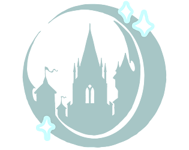
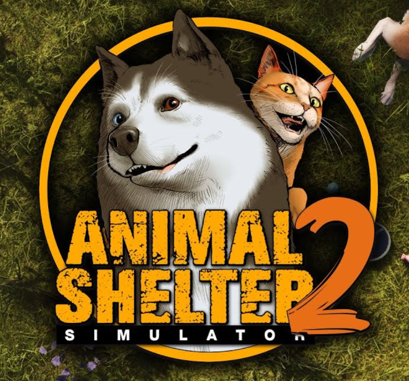
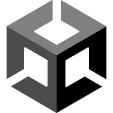
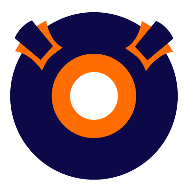
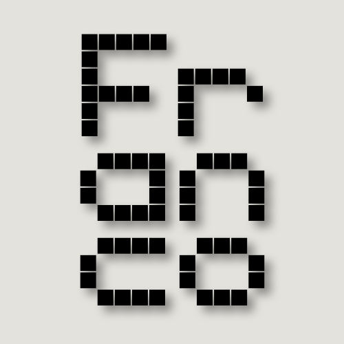
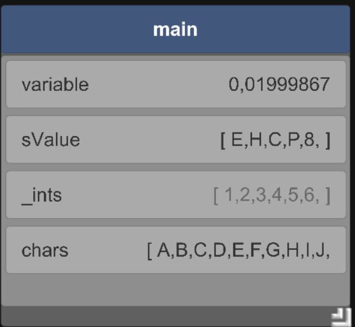

<head>
    <meta charset="UTF-8">
    <meta name="viewport" content="width=device-width, initial-scale=1.0">
    <title>Image Links with Descriptions</title>
    
        <link src="http://maxcdn.bootstrapcdn.com/font-awesome/4.1.0/css/font-awesome.min.css" rel="stylesheet">
        <link rel="stylesheet" href="https://cdnjs.cloudflare.com/ajax/libs/font-awesome/6.0.0-beta3/css/all.min.css">

</head>

<h1 style = "text-align: center;"> About me </h1>

I am a game programmer, as well as a student at Breda University Of Applied Sciences on Creative Media and Game Technologies programme. My main skillset revolves around AI and gameplay programming, yet I have extensive experience with tool development as well. I am proficient in C++ and C# and created multiple game projects (including commercial releases) in both Unity and Unreal Engine, I also have experience with working on custom engines and using them to make games. 
Currently interested in C++ game programming roles, especially focused on AI/Gameplay programming, as well as positions in Unity projects.

 

        <!-- Itch.io -->
        <a href="https://kenarf.itch.io" class="itch" target="_blank">
            <i class="fab fa-itch-io"></i>
        </a>
        <!-- GitHub -->
        <a href="https://github.com/FLuczak" class="github" target="_blank">
            <i class="fab fa-github"></i>
        </a>
        <!-- LinkedIn -->
        <a href="https://www.linkedin.com/in/franciszek-łuczak-02b9a8207/" class="linkedin" target="_blank">
            <i class="fab fa-linkedin"></i>
        </a>

 
<h1 style = "text-align: center"> Projects Completed </h1>

<h1 style = "text-align: center">Games</h1>

 

    <!-- Container 1 -->
    

        
        

            <h2>Owlet</h2>
             
            
             
            March 2024 - June 2024
             
            RTS game / Custom engine (C++) / AI and tools programmer
              
            Responsibilities:
            <ul>
                <li>Creating an AI framework with tools (visual scripting) for the designers to use.</li>
                <li>Writing gameplay functionality and AI mechanics based on the design team's input.</li>
                <li>Maintenance and development of the engine's core features (ECS, serialization, in-editor tools).</li>
                <li>Maintenance of the project's CI/CD pipelines and QA pipeline.</li>
                <li>Management of the programming team, communication with the producer, and distributing tasks within the programming team.</li>
                 
                <button class = "pretty-button"> Details</button>
            </ul>
             
        

    

    

    <!-- Container 2 -->
    

        
        

            <h2>Animal Shelter Simulator 2</h2>
            
             
            March 2024 - Current
             
            Simulation game / Unity Engine / Gameplay and tools programmer
              
            Responsibilities:
            <ul>
                <li>Designing the game's architecture in the initial development stage.</li>
                <li>Implementing gameplay mechanics based on the design team's documents.</li>
                <li>Maintenance of the codebase and bug fixing.</li>
                <li>Tools programming for the Level Design, QA, and Design teams to facilitate their workflows.</li>
                <li>Maintaining documentation of the codebase.</li>
                 
                                 
                         
                <button class= "pretty-button"> Details</button>
            </ul>
        

    

 
 

    <!-- Container 1 -->
    

        
        

            <h2>Smash Balls</h2>
            <svg xmlns="http://www.w3.org/2000/svg" width="2em" height="2em" viewBox="0 0 24 24">
                <path fill="currentColor"
                    d="M12 0a12 12 0 1 0 12 12A12 12 0 0 0 12 0m0 23.52A11.52 11.52 0 1 1 23.52 12A11.52 11.52 0 0 1 12 23.52m7.13-9.791c-.206.997-1.126 3.557-4.06 4.942l-1.179-1.325l-1.988 2a7.34 7.34 0 0 1-5.804-2.978a3 3 0 0 0 .65.123c.326.006.678-.114.678-.66v-5.394a.89.89 0 0 0-1.116-.89c-.92.212-1.656 2.509-1.656 2.509a7.3 7.3 0 0 1 2.528-5.597a7.4 7.4 0 0 1 3.73-1.721c-1.006.573-1.57 1.507-1.57 2.29c0 1.262.76 1.109.984.923v7.28a1.2 1.2 0 0 0 .148.256a1.08 1.08 0 0 0 .88.445c.76 0 1.747-.868 1.747-.868V9.172c0-.6-.452-1.324-.905-1.572c0 0 .838-.149 1.484.346a6 6 0 0 1 .387-.425c1.508-1.48 2.929-1.902 4.112-2.112c0 0-2.151 1.69-2.151 3.96c0 1.687.043 5.801.043 5.801c.799.771 1.986-.342 3.059-1.441Z"/>
            </svg>
             
            April 2023-June 2023
             
            Arcade co-op game / Unreal Engine (C++ and Blueprints) / Gameplay programmer
              
            Responsibilities:
            <ul>
                <li>Design of game's architecture in the early stages of development</li>
                <li>Implementation and maintenance of gameplay mechanics based on the design team's input</li>
                <li>Implementation of gameplay features in C++ that technical designers and other programmers could use in blueprints for rapid prototyping</li>
                 
                 
            </ul>
        

        <button class= "pretty-button"> Details</button>
    

    <!-- Container 2 -->
    

        
        

            <h2>Animal Shelter Simulator</h2>
            
             
            March 2022 - March 2023
             
            Simulation game / Unity Engine / AI and gameplay programmer
              
            Responsibilities:
            <ul>
                <li>Rebuilding the core AI system of the game and implementing custom tools for the design team to use</li>
                <li>Implementing gameplay mechanics and AI functionalities based on the design team's input</li>
                <li>Maintenance of the codebase and bug fixing</li>
                <li>Implementing a tool for the QA team for easier testing</li>
                <li>Maintenance of the QA pipeline including live automatic bug reporting and logging</li>
            </ul>
        

        <button class= "pretty-button"> Details</button>
    

    <!-- Container 1 -->
    

        
        

            <h2>Fall dude</h2>
             
            
             
            September 2022 - November 2022
             
            Arcade mobile game / Unity engine 
              
            Responsibilities:
            <ul>
               <li>Designing the game and its architecture</li>
                <li>Adding gameplay mechanics</li>
                <li>Integrating Google APIs to the project (admob, google play games, firebase) </li>
                 
                <button class = "pretty-button"> Details</button>
            </ul>
             
        

    

    

        
        

            <h2>Boing boing ball</h2>
             
            
             
            January 2022 - April 2022
             
            Arcade mobile game / Unity engine 
              
            Responsibilities:
            <ul>
             <li>Designing the game and its architecture</li>
                <li>Adding gameplay mechanics</li>
                <li>Integrating Google APIs to the project (admob, google play games, firebase) </li>
                 
                <button class = "pretty-button"> Details</button>
            </ul>
             
        

    

<h1 style = "text-align: center">Tools</h1>

    <!-- Container 1: Pepi Engine -->
    

        
        

            <h2>Pepi Engine</h2>
            
             
            This engine was created for a project at Breda University of Applied Sciences to facilitate the development of RTS games. My responsibilities included:
            <ul>
                <li>AI editor for Finite State Machines and Behavior Trees.</li>
                <li>Animation Controllers and grid-based navigation.</li>
                <li>CI/CD and QA pipelines using GitHub Actions.</li>
            </ul>
        

    

    <!-- Container 2: Franco Engine -->
    

        
        

            <h2>Franco Engine</h2>
            
             
            A passion project created in my free time. This engine is universal but optimized for bullet hell and top-down roguelikes. Key features I developed include:
            <ul>
                <li>Navmesh navigation.</li>
                <li>AI structures with a visual editor.</li>
                <li>Performant physics system.</li>
                <li>Entity and component serialization.</li>
                <li>Asset explorer.</li>
            </ul>
        

    

    <!-- Container 3: Visual Debug Console -->
    

        
        

            <h2>Visual Debug Console</h2>
            
             
            An open-source project I co-created while working at a games incubator. This tool is widely used across multiple game projects for QA processes and playtesting. Its key features include:
            <ul>
                <li>Replacing the classic debug console with a user-friendly interface.</li>
                <li>Programmatic buttons bound to in-game functions.</li>
                <li>Live variable previews for enhanced debugging.</li>
            </ul>
        

    

